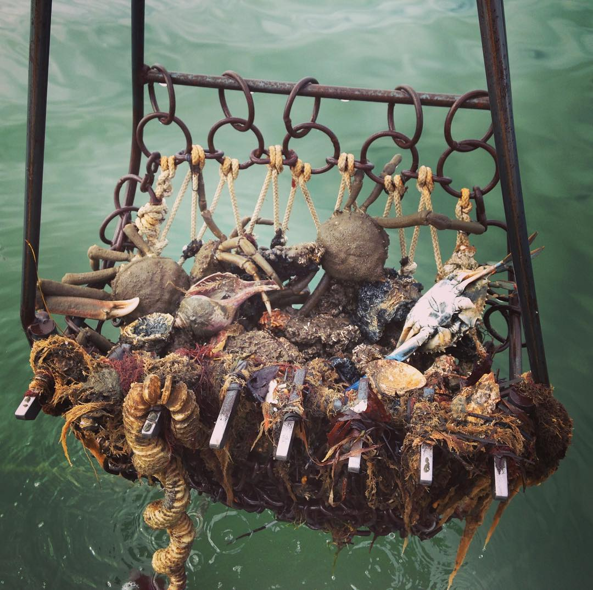
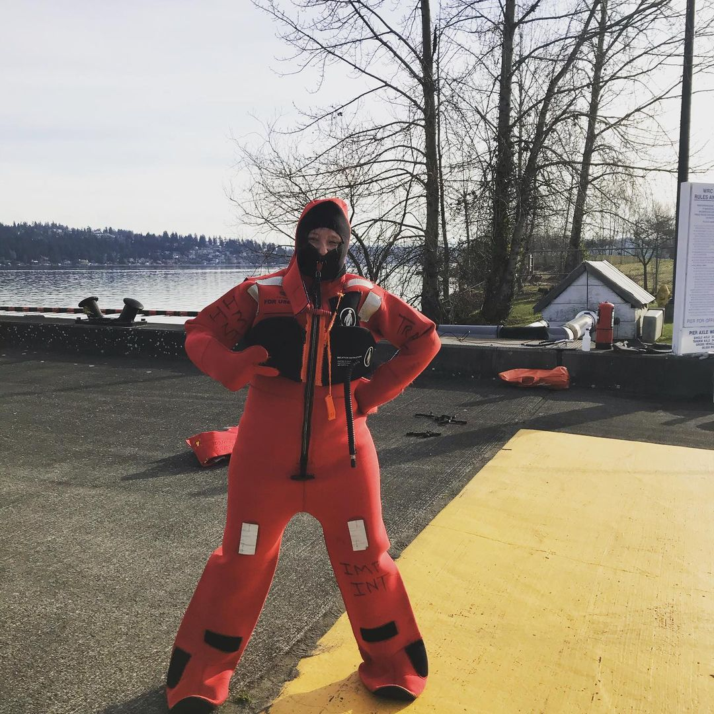
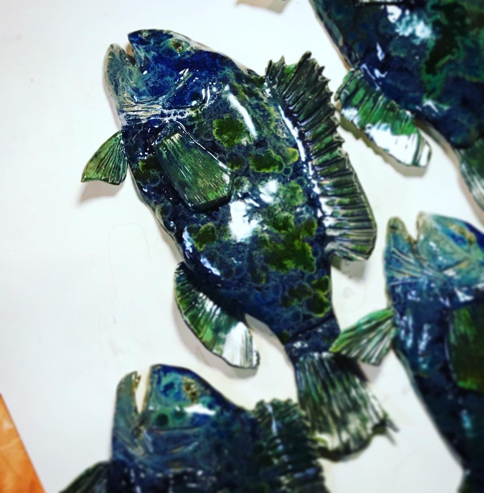

```{r, include=FALSE}
knitr::opts_chunk$set(echo = FALSE, warning=FALSE, 
                      error = FALSE, message = FALSE)

# https://stackoverflow.com/questions/25415365/insert-side-by-side-png-images-using-knitr
imgsize <- "100px"
```

```{r, include = FALSE, eval = FALSE}
#expressly for troubleshooting scripts, will not run in markdown (eval = FALSE)
sections <- c("about")
i<-1
rmarkdown::render(paste0("./", sections[i], ".Rmd"),
                output_dir = "./_site/",
                output_file = paste0(sections[i], ".html"))
```

<center>

{width=`r paste(imgsize)`} {width=`r paste(imgsize)`} {width=`r paste(imgsize)`} {width=`r paste(imgsize)`}   {width=`r paste(imgsize)`} {width=`r paste(imgsize)`}

</center>


<br>


<div class = "row">
<div class = "col-md-5">

```{r}

library(leaflet)
# library(DT)
library(leafpop)
library(maps)
library(magrittr)
library(fontawesome) #devtools::install_github("rstudio/fontawesome")

places<-data.frame("place" = c("Hometown", 
                               "Grad School at Stony Brook University's School of Marine and Atmospheric Sciences", 
                               "Knauss Fellowship with NOAA", 
                               "Alaska Fisheries Science Center, Seattle", 
                               "Field Work, Bering Sea"),
                   img = c("./images/croton.jpg", 
                           "./images/seawolf.jpg", 
                           "./images/knauss.jpg",
                           "./images/gumbysuit.jpg", 
                           "./images/dutchharbor.jpg"), 
                   imgurl = c(
                     "https://www.instagram.com/p/BSY8I0Vhpmz/",
                     "https://www.instagram.com/p/BTAyd3ahFsa/", 
                     "https://www.instagram.com/p/BWl2x9FB9L1/", 
                     "https://www.instagram.com/p/CQKhlr9nPqu/", 
                     "https://www.instagram.com/p/CRO5o1rnhFj/"), 
                   "type" = c("home", "sbu", "dc", "afsc", "field"), 
                    "lat" = c(41.199017, 40.902866, 38.992836, 47.686254, 62.299624), 
                    "lng" = c(-73.928150, -73.125015, -77.031054, -122.253657, -171.262273))


# https://github.com/rstudio/leaflet/issues/691

# icoLst <- awesomeIconList(
#   home = makeAwesomeIcon(
#     text = fa("pizza-slice"), 
#     iconColor = "orange", 
#     markerColor = "white"),
#   sbu = makeAwesomeIcon(
#     text = fa("graduation-cap"), 
#     iconColor = "red", 
#     markerColor = "white"),
#   dc = makeAwesomeIcon(
#     text = fa("handshake"), 
#     iconColor = "green", 
#     markerColor = "white"),
#   afsc = makeAwesomeIcon(
#     text = fa("laptop-code"), 
#     iconColor = "purple", 
#     markerColor = "white"),
#   field = makeAwesomeIcon(
#     text = fa("ship"), 
#     iconColor = "blue", 
#     markerColor = "white"))


imgs <- places$img

places %>%
  leaflet(width = "100%") %>% 
  addProviderTiles(providers$Esri.NatGeoWorldMap) %>%
  # addTiles() %>%
  addCircleMarkers(
    fillOpacity = 0.8, 
    radius = 10,
    color = "#34304a",
    # addAwesomeMarkers(icon = ~icoLst[type], 
    label= ~place, 
    lng = ~lng, 
    lat = ~lat,
    popup = popupImage(img = imgs, width = 150))

```

</div>


<div class = "col-md-7">


I'm a Research Fisheries Biologist in the Eastern Bering Sea Survey Team in the Groundfish Assessment Group at **NOAA Fisheries Alaska Fisheries Science Center** (AFSC) in Seattle, WA. Before AFSC, I worked in Silver Spring, MD where I was a contractor for the **Office of Science and Technology** (OST) in the Economics and Social Analysis Division providing statistical and data visualization expertise for the national annual Fisheries Economics of the US report. Before that, I was a **John A. Knauss Marine Policy Fellow** working in OST’s Assessment and Monitoring Division’s Protected Species Science Branch working on sea turtle issues and marine mammal acoustics. I obtained my BS and MS degrees in quantitative fisheries ecology from Stony Brook University. My **thesis** research focused on the development of species distribution models that combined fisheries-independent bottom trawl survey data with oceanographic models to predict suitable habitat and distributional shifts. 

**I grew up** in New York's Hudson Valley and have a deep appreciation for the **Hudson River**. Learning as a kid about the role this iconic river played in making New York City, the critters, like the hudson sturgeon, who dwell in it's mucky bottom, and how changes in this ecosystem helped make the case for landmark environmental legislation and conservation were important seeds of inspiration for the work I do today. 

In my **spare time**, I enjoy hiking and camping, enthusiastically bantering with classrooms about all things science and how cool the ocean is, and studying my fish friends through water color or clay! 

</div>

</div>

<br>


