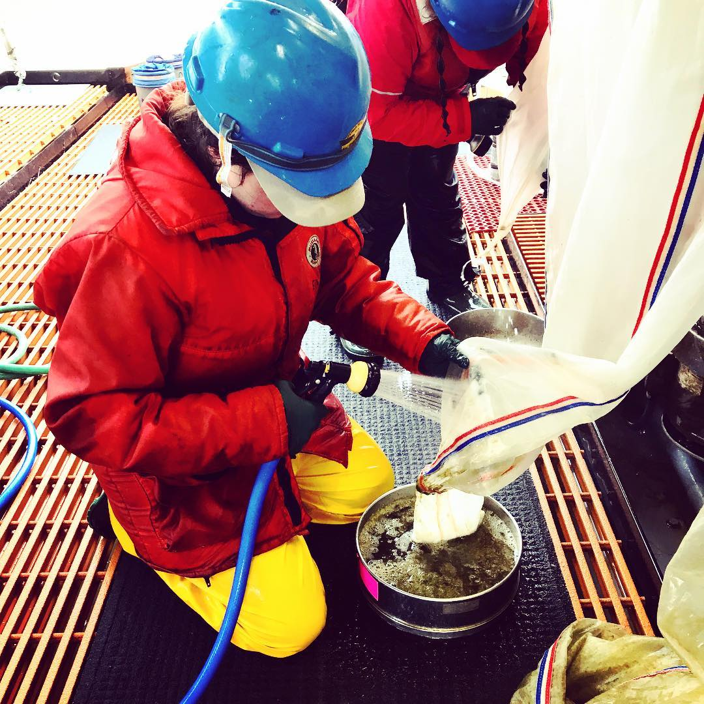

```{r, include=FALSE}
knitr::opts_chunk$set(echo = FALSE, warning=FALSE, 
                      error = FALSE, message = FALSE)

# https://stackoverflow.com/questions/25415365/insert-side-by-side-png-images-using-knitr
imgsize <- "100px"
```

```{r, include = FALSE, eval = FALSE}
#expressly for troubleshooting scripts, will not run in markdown (eval = FALSE)
sections <- c("about")
i<-1
rmarkdown::render(paste0("./", sections[i], ".Rmd"),
                output_dir = "./docs/",
                output_file = paste0(sections[i], ".html"))
```

<center>

{width=`r paste(imgsize)`} {width=`r paste(imgsize)`} {width=`r paste(imgsize)`} {width=`r paste(imgsize)`}   {width=`r paste(imgsize)`} {width=`r paste(imgsize)`}

</center>


<br>


<div class = "row">
<div class = "col-md-5">

```{r}

library(leaflet)
# library(DT)
library(leafpop)
library(maps)
library(magrittr)
library(fontawesome) #devtools::install_github("rstudio/fontawesome")

places<-data.frame("place" = c("Hometown", 
                               "Grad School at Stony Brook University's School of Marine and Atmospheric Sciences", 
                               "Knauss Fellowship with NOAA", 
                               "Alaska Fisheries Science Center, Seattle", 
                               "Field Work, Bering Sea"),
                   img = c("./images/croton.jpg", 
                           "./images/seawolf.jpg", 
                           "./images/knauss.jpg",
                           "./images/gumbysuit.jpg", 
                           "./images/dutchharbor.jpg"), 
                   imgurl = c(
                     "https://www.instagram.com/p/BSY8I0Vhpmz/",
                     "https://www.instagram.com/p/BTAyd3ahFsa/", 
                     "https://www.instagram.com/p/BWl2x9FB9L1/", 
                     "https://www.instagram.com/p/CQKhlr9nPqu/", 
                     "https://www.instagram.com/p/CRO5o1rnhFj/"), 
                   "type" = c("home", "sbu", "dc", "afsc", "field"), 
                    "lat" = c(41.199017, 40.902866, 38.992836, 47.686254, 62.299624), 
                    "lng" = c(-73.928150, -73.125015, -77.031054, -122.253657, -171.262273))


# https://github.com/rstudio/leaflet/issues/691

# icoLst <- awesomeIconList(
#   home = makeAwesomeIcon(
#     text = fa("pizza-slice"), 
#     iconColor = "orange", 
#     markerColor = "white"),
#   sbu = makeAwesomeIcon(
#     text = fa("graduation-cap"), 
#     iconColor = "red", 
#     markerColor = "white"),
#   dc = makeAwesomeIcon(
#     text = fa("handshake"), 
#     iconColor = "green", 
#     markerColor = "white"),
#   afsc = makeAwesomeIcon(
#     text = fa("laptop-code"), 
#     iconColor = "purple", 
#     markerColor = "white"),
#   field = makeAwesomeIcon(
#     text = fa("ship"), 
#     iconColor = "blue", 
#     markerColor = "white"))


imgs <- places$img

places %>%
  leaflet(width = "100%") %>% 
  addProviderTiles(providers$Esri.NatGeoWorldMap) %>%
  # addTiles() %>%
  addCircleMarkers(
    fillOpacity = 0.8, 
    radius = 10,
    color = "#34304a",
    # addAwesomeMarkers(icon = ~icoLst[type], 
    label= ~place, 
    lng = ~lng, 
    lat = ~lat,
    popup = popupImage(img = imgs, width = 150))

```

</div>

<div class = "col-md-7">

Emily Markowitz is a Research Fisheries Biologist in **NOAA Fisheries Alaska Fisheries Science Center's** (AFSC) Bering Sea Survey Team in Seattle, WA. There, she ventures on surveys, conducts statistical analyses, and develops data products to better understand the marine ecosystems of the Bering Sea region. Previously, Em was a contractor within the **Office of Science and Technology** (OST) in Silver Spring, MD and primarily worked with the [Economics and Social Analysis Division](https://www.fisheries.noaa.gov/topic/socioeconomics) to provide statistical and data visualization expertise. As a [**John A. Knauss Marine Policy Fellow**](https://seagrant.noaa.gov/Knauss-Fellowship-Program) in OST's [Assessment and Monitoring Division’s](https://www.fisheries.noaa.gov/topic/population-assessments), Em facilitated protected species science at the national level with researchers in fisheries and marine mammal sciences.

**Science should be open, accessible, and collaborative.** In each of her positions, Em has also been actively involved in teaching and promoting the use of open science and R programming across NOAA Fisheries. She is an [Openscapes](https://www.openscapes.org/) mentor, as well as a co-organizer of the [NMFS R Users Group](https://nmfs-opensci.github.io/NMFS-R-UG/). 

Em obtained her BS and MS degrees in quantitative fisheries ecology from Stony Brook University. Her **thesis** research focused on the development of species distribution models that combined fisheries-independent bottom trawl survey data with oceanographic models to predict suitable habitat and distributional shifts. 

**I grew up** in New York's Hudson Valley and have a deep appreciation for the **Hudson River**. This iconic river, besides being the best sixth borough of NYC and beautiful, is home to my favorite fish friends, like the Hudson sturgeon, and has seen changes in its ecosystem with overfishing and pollution that lead to important landmark environmental legislation and conservation, heavily inspiring the work I do today. 

In my **spare time**, I enjoy hiking and camping, enthusiastically bantering with classrooms about all things science and how cool the ocean is, and studying my fish friends through water color or clay! 

</div>

</div>

<br>


